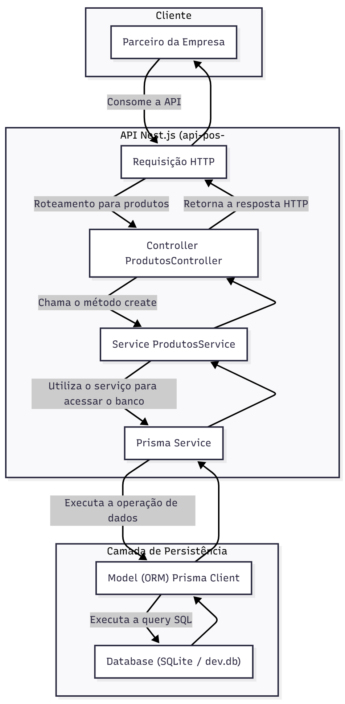

# API de Vendas Online - Projeto de Pós-Graduação

Esta é uma API REST desenvolvida como parte de um projeto de pós-graduação, com o objetivo de disponibilizar dados de um domínio de negócio (Produtos) para parceiros da empresa.

A aplicação foi construída utilizando **Nest.js**, um framework Node.js progressivo para a construção de aplicações server-side eficientes e escaláveis. A persistência de dados é gerenciada pelo ORM **Prisma** com um banco de dados **SQLite**.




## Arquitetura

A solução segue o padrão arquitetural **MVC (Model-View-Controller)**, com uma clara separação de responsabilidades:

*   **Model:** Definido pelo `schema.prisma`, que descreve a estrutura dos dados. O Prisma Client atua como a camada de acesso a dados (ORM).
*   **Controller:** Responsável por receber as requisições HTTP, validar as entradas e delegar a lógica de negócio para a camada de Serviço.
*   **Service:** Contém a lógica de negócio da aplicação, orquestrando as operações e interagindo com a camada de persistência.

## Estrutura de Pastas

A estrutura do projeto foi organizada de forma modular para garantir a escalabilidade e manutenibilidade do código.

```
api-pos-graduacao/
├── prisma/                     # Configuração, schema e migrações do Prisma
│   ├── migrations/             # Migrações geradas pelo Prisma
│   └── schema.prisma           # [MODEL] Definição do modelo de dados
├── src/                        # Código-fonte da aplicação
│   ├── produtos/               # Módulo de feature "Produtos"
│   │   ├── produtos.controller.ts  # [CONTROLLER] Gerencia as rotas e requisições HTTP
│   │   ├── produtos.service.ts     # [SERVICE] Contém a lógica de negócio
│   │   └── produtos.module.ts    # Agrupa os componentes do módulo
│   │
│   ├── prisma/                 # Módulo de infraestrutura para o Prisma
│   │   ├── prisma.service.ts     # Serviço que encapsula e provê o Prisma Client
│   │   └── prisma.module.ts
│   │
│   ├── app.module.ts           # Módulo raiz da aplicação
│   └── main.ts                 # Ponto de entrada da aplicação (bootstrap)
│
├── .env                        # Arquivo para variáveis de ambiente (NÃO versionar)
├── package.json                # Dependências e scripts do projeto
└── tsconfig.json               # Configurações do TypeScript
```

## Pré-requisitos

Antes de começar, você vai precisar ter instalado em sua máquina:
*   [Node.js](https://nodejs.org/en/) (v16 ou superior)
*   [NPM](https://www.npmjs.com/) ou [Yarn](https://yarnpkg.com/)

## Instalação e Configuração

1.  **Clone o repositório:**
    ```bash
    git clone <URL_DO_SEU_REPOSITORIO>
    cd api-pos-graduacao
    ```

2.  **Instale as dependências:**
    ```bash
    npm install
    ```

3.  **Configure as variáveis de ambiente:**
    Crie um arquivo chamado `.env` na raiz do projeto e adicione o seguinte conteúdo. Ele irá configurar o Prisma para usar um banco de dados SQLite local.
    ```env
    DATABASE_URL="file:./dev.db"
    ```

4.  **Execute as migrações do banco de dados:**
    Este comando irá criar o banco de dados SQLite e as tabelas com base no `schema.prisma`.
    ```bash
    npx prisma migrate dev
    ```

## Executando a Aplicação

Para iniciar o servidor em modo de desenvolvimento (com hot-reload), execute:

```bash
npm run start:dev
```

A API estará disponível em `http://localhost:3000`.

## Endpoints da API

A seguir, a lista de endpoints disponíveis para o recurso `/produtos`.

| Método | Endpoint                  | Descrição                                | Exemplo de Body (JSON)                                            |
| :----- | :------------------------ | :--------------------------------------- | :---------------------------------------------------------------- |
| `POST` | `/produtos`               | Cria um novo produto.                    | `{ "nome": "Mouse Gamer", "preco": 350.00 }`                      |
| `GET`  | `/produtos`               | Retorna uma lista de todos os produtos.  | N/A                                                               |
| `GET`  | `/produtos/count`         | Retorna o número total de produtos.      | N/A                                                               |
| `GET`  | `/produtos/:id`           | Retorna um produto específico pelo ID.   | N/A                                                               |
| `GET`  | `/produtos/search?nome=X` | Retorna produtos cujo nome contenha "X". | N/A                                                               |
| `PATCH`| `/produtos/:id`           | Atualiza os dados de um produto.         | `{ "preco": 325.50, "descricao": "Mouse com RGB" }`               |
| `DELETE`| `/produtos/:id`          | Exclui um produto pelo ID.               | N/A                                                               |